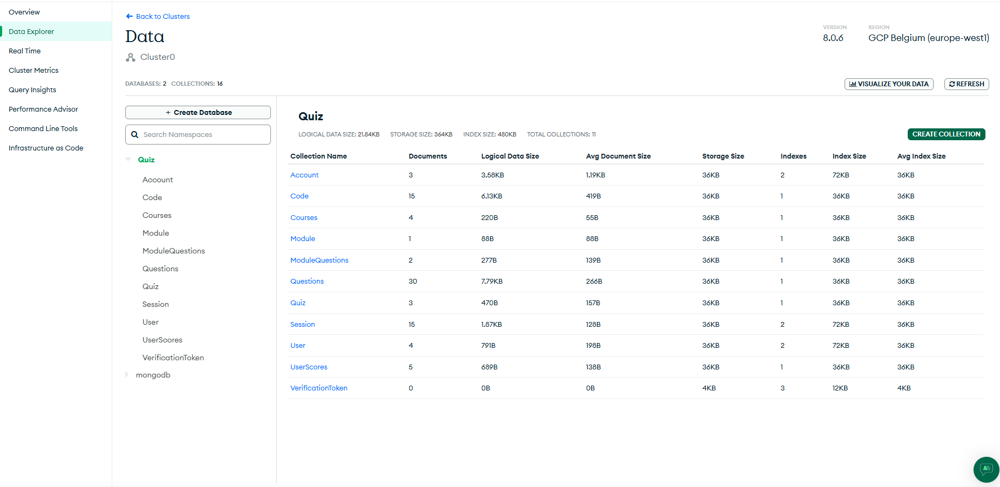
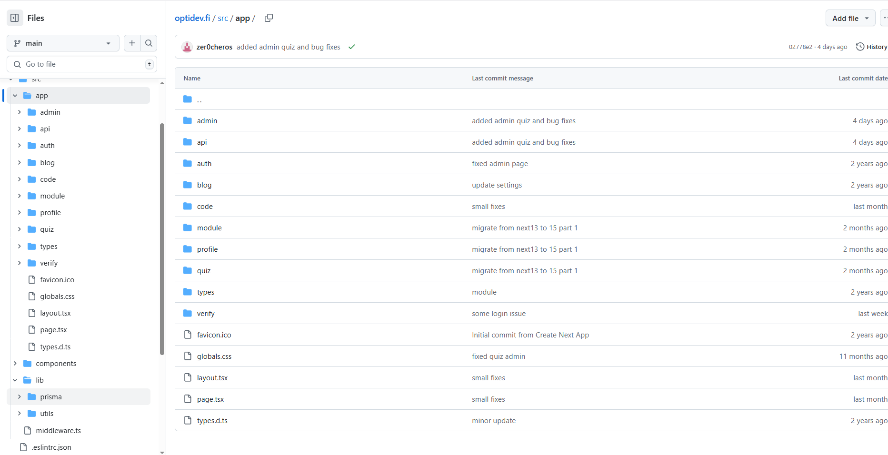
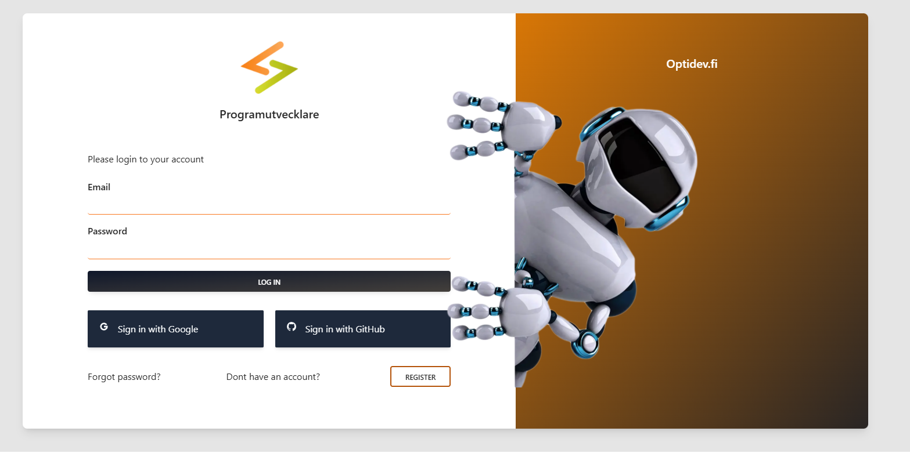
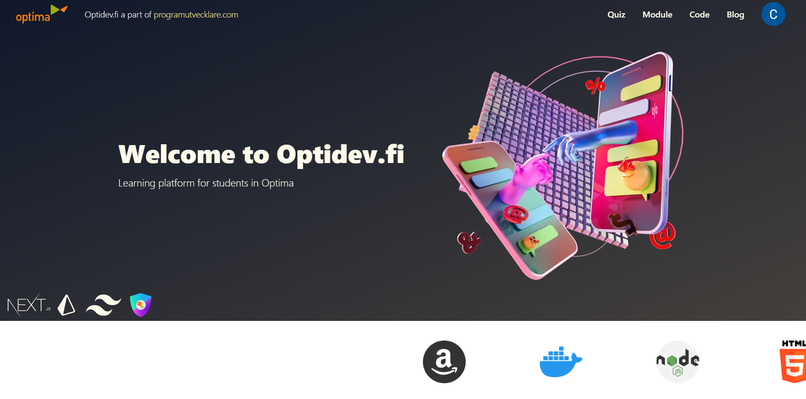
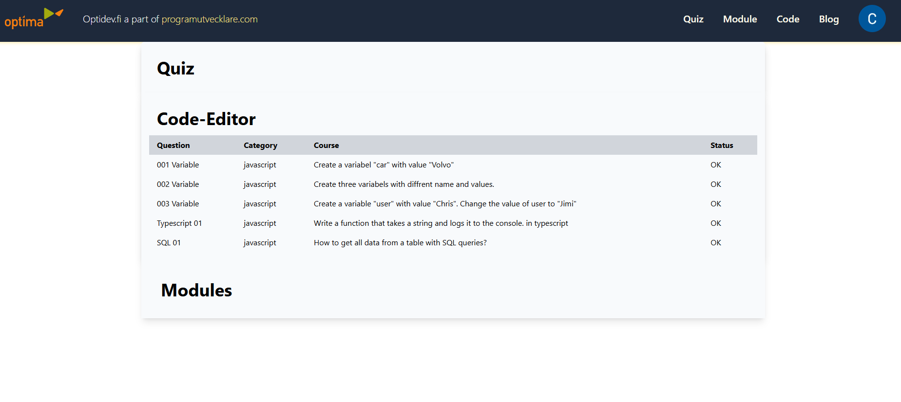
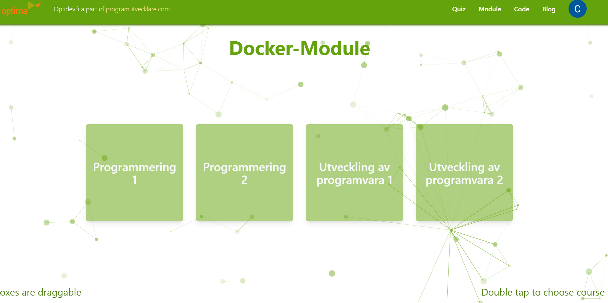

# Project Phase 2 – Basic Structure and Main Functionalities

This phase focuses on implementing the core technical structure and primary features of the Optidev.fi platform.

---

## 1. Environment

The project is currently deployed on **Vercel** for both frontend and backend hosting, providing a scalable cloud platform with CI/CD integration. DNS is managed through **AWS Route 53**, ensuring reliable domain routing and security.

---

## 2. Backend

The backend is built using the built-in API routes of **Next.js** (Node.js/Express under the hood). It handles:
- Authentication with `next-auth`
- Quiz and module management
- User session tracking
- User progress and score storage
- Docker container management (via API calls to local Proxmox VM thorough Cloudflare tunnel)

---

## 3. Frontend

The frontend is developed using **Next.js with Tailwind CSS**. It features:
- A modular component-based structure
- Pages for quizzes, the code editor, stats, and admin control
- Responsive design for mobile and desktop use


---

## 4. Database

Currently using **MongoDB** for managing users, quizzes, modules, and sessions. Considering a migration to PostgreSQL later for relational advantages.

Database structure:

---

## 5. Basic Structure and Architecture

- Next.js handles both frontend and backend (API routes)
- Docker containers are orchestrated externally (Proxmox layer)
- Clear separation of concerns between frontend views, backend routes, and infrastructure
- Organized folder structure with `/app`, `/components`, `/api`, `/lib`
- Cloudflare tunnel for secure, remote access to internal systems

Stucture:


---

## 6. Functionalities

Currently implemented:
- Login and registration via OAuth (Google, GitHub)
- Quiz system with multiple-choice and score tracking
- Docker-based terminal environment (Linux training)
- Code editor with run functionality (using Monaco Editor and OpenAI API for code completion)
- User profile page displaying quiz progress and scores
- Admin interface for managing content

Login page:


---

## 7. Code Quality and Documentation

- Code follows consistent styling using ESLint and Prettier
- Component structure is clean and i´m trying to make "reusable"
code page:
````tsx 
import React from 'react'
import { getAllCourse } from '@/lib/utils/backend/course/handleCourse'
import NavbarCode from '@/components/LayoutComponents/Layout/NavbarCode'
import CoursesBox from '@/components/LayoutComponents/Layout/Courses'


export default async function Code() {
  // Fetch all courses from the database
  const courses = await getAllCourse()
  return (
    <>
      <NavbarCode shadow={'shadow-cyan-700'} color={'bg-cyan-600'} />
      {/* Reuseable component for all modules and tasks */}
        <CoursesBox w={1250} h={1250} url={'code'} imgSrc={'/water.png'} color='#0891b2' courses={courses} heading={'Code-Editor'} />
        <p className='absolute bottom-4 right-4 text-3xl text-cyan-700'>Double tap to choose course</p>
        <p className='absolute bottom-4 left-4 text-3xl text-cyan-700'>Boxes are draggable</p>
    </>
  )
}
````
- Inline comments where applicable
- Setup and usage guides available in `README.md`
- Trying to make pages clear and easy to understand

main page:
````tsx
import Hero from "@/components/LayoutComponents/Layout/Hero"
import Content from "@/components/LayoutComponents/Layout/Content"
import Banner from "@/components/LayoutComponents/Layout/Banner"
import Footer from "@/components/LayoutComponents/Layout/Footer"

export default async function Home() {
  return (
    <main className="-top-24 relative -z-20">
      <Hero/>
      <Banner/>
      <Content/>
      <Footer/>
    </main>
  )
}
````
---

## 8. Testing and Error Handling

- Manual testing of frontend components and backend API endpoints
- Basic validation and error feedback in the UI
- Try/catch blocks and error logs in API routes
- Plans for automated testing in Phase 3

---

## 9. User Interface and Interaction

- Modern UI with Tailwind CSS
- Responsive design for multiple screen sizes
- Clear layout and feedback for user actions
- Admin interface is functional and accessible

Main page:


Profile page:


Module page:


